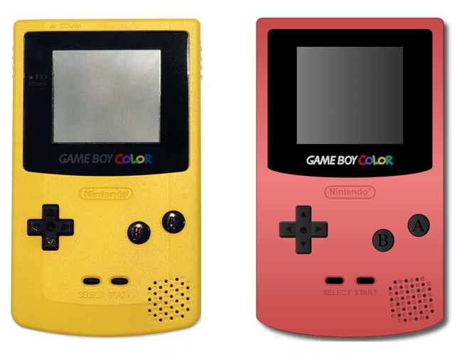
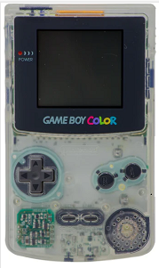
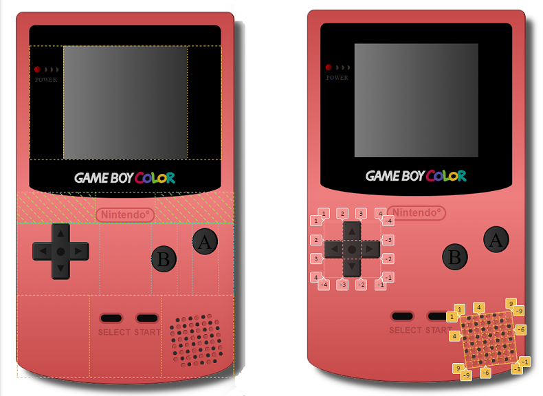

*First in Spanish then in* [*English*](https://github.com/ansualo/proyecto1-consola/edit/master/README.md#videoconsole-with-css)

---

# Videoconsola con CSS 

### Tabla de contenidos 

- ¿Qué es?
- ¿Cómo funciona?
- Desarrollo y tecnologías usadas
- Errores conocidos 
- Créditos 

 
*Puedes ver el proyecto* [*aquí.*](ansualo.github.io/proyecto1-consola/)

---

### ¿Qué es? 

Se trata de una reproducción de la consola Game Boy Color, creada en un ámbito educativo para GeeksHubs Academy. En la siguiente imagen podemos apreciar su similitud con la original: 

---

### ¿Como funciona? 

Al deslizar el cursor por los botones simulará que estos están siendo presionados.

Pulsando el botón **START** aparecerá en la pantalla una animación del arranque de la consola original.  

Pulsando el botón **SELECT** la consola se volverá transparente dejando ver su placa base. Esto es un guiño a la famosa Game Boy Atomic Purple con su funda transparente lanzada en los años 90. 

 ---

### Desarrollo y tecnologías usadas 

Este proyecto ha sido creado desde cero usando HTML y CSS, además de JavaScript para los elementos interactivos de los botones SELECT y START anteriormente mencionados. El único elemento externo es la imagen del logo de GameBoy Color usado en la parte inferior de la pantalla. 

El cuerpo de la consola esta creado con diferentes divs anidados para crear las diferentes secciones. Como se puede apreciar en la siguiente imagen, primero dividí el cuerpo en tres secciones principales y, a su vez, estas se dividieron en partes más pequeñas para poder ir creando los detalles de la consola. Me he ayudado de *display:flex* en su mayoría, y *display:grid* a la hora de hacer la cruceta y el altavoz. 

Para dar un aspecto más realista también he utilizado propiedades de CSS como *background-image: linear-gradient, box-shadow* y *border radius*. 

Uno de los factores de mayor dificultad fue la utilización de sombras para darle una imagen lo más realista posible. 

---

### Errores conocidos 

Uno de los errores que me gustaría mejorar es el funcionamiento de JavaScrip para que se pudiera volver al estado original de la consola sin tener que refrescar la página. 

Otro detalle que podría ser mejorado es la cruceta, ya que actualmente se pueden apreciar los diferentes divs que la componen en vez de ser un solo botón.  

---

### Créditos 

Este proyecto ha sido realizado por mí, Andrea Suárez, en abril de 2023. 

---
---
---

# Videoconsole with CSS 

### Table of contents 

- What is it?
- How does it work?
- Development and technologies used
- Known bugs 
- Credits 

 
*You can view the project* [*here.*](ansualo.github.io/proyecto1-consola/)

---

### What is it? 

It is a reproduction of the Game Boy Color console, created in an educational environment for GeeksHubs Academy. In the following image we can appreciate its similarity to the original: 

---

### How does it work? 

By sliding the cursor over the buttons it will simulate that they are being pressed.

Pressing the **START** button will display an animation of the original console starting up.  

Pressing the **SELECT** button will make the console transparent, revealing its motherboard. This is a nod to the famous Game Boy Atomic Purple with its transparent case released in the 90s. 

 ---

### Development and technologies used 

This project has been created from scratch using HTML and CSS, plus JavaScript for the interactive elements of the previously mentioned SELECT and START buttons. The only external element is the image of the GameBoy Color logo used at the bottom of the screen. 

The body of the console is created with different nested divs to create the different sections. As you can see in the image below, I first divided the body into three main sections and these were then divided into smaller parts to create the details of the console. I used *display:flex* for the most part, and *display:grid* for the cross button and the speaker. 

To give a more realistic look I also used CSS properties like *background-image: linear-gradient, box-shadow* and *border radius*. 

One of the most difficult factors was the use of shadows to make the image as realistic as possible. 

---

### Known bugs 

One of the bugs I would like to fix is the way JavaScript works so that you could return to the original state of the console without having to refresh the page. 

Another detail that could be improved is the cross button, as currently you can see the different divs that compose it instead of being a single button.  

---

### Credits 

This project has been made by me, Andrea Suárez, in April 2023.
